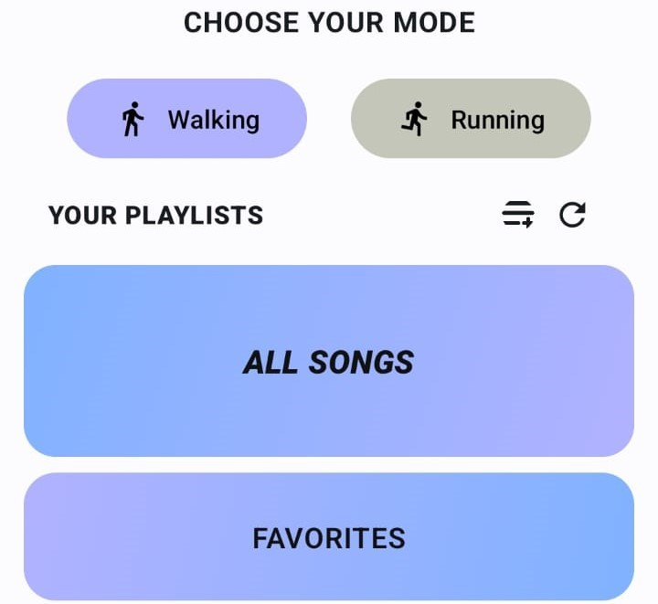

# BuddyBeat   
**_Music that moves with you_**

**BuddyBeat** is an Android mobile player application that adjusts the music playback speed in real time according to your walking or running pace, while also dynamically reordering your playlist to best match your workout rhythm.

## Motivation and Concept
It all started with a question: **How can we make workouts more engaging and enjoyable?** For many of us, music is an essential part of our workouts, providing the motivation needed to get through challenging runs or to simply enjoy a walk. 
However, finding the right music in the moment of activity can be tough, and having inadequate song interrupt the flow can be frustrating. So we wanted to address this problem faced by fitness enthusiasts: **staying in the rhythm during a workout**.  
The idea behind BuddyBeat was to create a simple, intuitive, and engaging app that is easy to use and feels like a natural extension of a workout routine.

## Project Description
The app is structured similarly to a standard music player, allowing the user to play, skip and pause songs, add them to favorites, create and manage playlists etc. However, BuddyBeat offers two new features: 
- **Real-time Speed Adjustment**: Adjust the speed of the current song to match your activity, using your phone's accelerometer to detect your pace.
- **Dynamic Playlist Reordering**: Dynamically update the playlist queue to ensure future songs align with your workout rhythm, making transitions smoother and workouts more engaging.

With BuddyBeat, workouts become more immersive, as the music responds to your pace, helping you maintain a consistent rhythm and enjoy a more enjoyable fitness routine.

## Installation
To install and use BuddyBeat, follow these steps:
1. Clone the repository:
`git clone https://github.com/marcello-grati/BuddyBeat.git`
2. Open the project in Android Studio.
3. Build and run the project on your Android device.

## Usage
 

**1. Launch the BuddyBeat App**

After launching the app, BuddyBeat will automatically scan and load all songs stored locally on your device. The app will calculate the BPM (Beats Per Minute) of each song in your library to ensure that music tempo can be synchronized with your pace.

**2. Select Your Mode**

Choose between two workout modes:
  - Walking Mode
  - Running Mode

  

The UI color will change to visually indicate which mode you are in, helping you to easily distinguish between walking and running modes.

**3. Choose a Playlist and a Song**

Once the mode is selected, you can choose the playlist and the song you want to start with and the app operates in an automatic way:
- Pace Detection: Using your phone's accelerometer, BuddyBeat continuously monitors your walking or running speed.
- Real-time Song Speed Adjustment: Based on your detected pace, the app adjusts the speed of the current song to match your activity level.
- Dynamic Playlist: The playlist is updated in real-time to ensure that future songs align with your current rhythm.

**4. Switch to Manual Mode (Optional)**

If you prefer a fixed tempo, you can switch to Manual Mode and choose a specific BPM for your workout. The app will maintain this tempo across all songs, regardless of your movement.

 

## DEMO

[BuddyBeat Demo](https://drive.google.com/file/d/1ew2s8qyJSlEIZ6_KyjIaAgWW6tbR2ach/view?usp=drive_link)

## Technologies Used
- Android SDK for software development
- Kotlin as programming language
- [Jetpack Compose](https://developer.android.com/compose) for UI
- [Jetpack Media3](https://developer.android.com/media/media3) for handling music playback and speed adjustments
- [Room](https://developer.android.com/training/data-storage/room) for local database
- [DataStore](https://developer.android.com/topic/libraries/architecture/datastore) for preferences storage
- [TarsosDSP](https://0110.be/posts/TarsosDSP_on_Android_-_Audio_Processing_in_Java_on_Android) for BPM calculation

## Group
- Marcello Grati
- Chiara Lunghi
- Silvia Pasin
- Natasa Popovic
